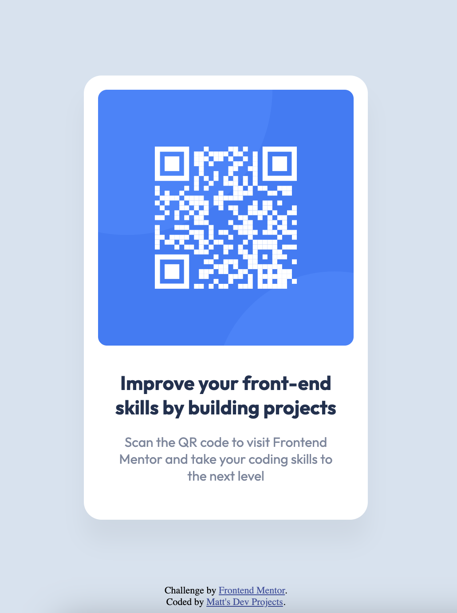

# Frontend Mentor - QR code component solution

This is a solution to the [QR code component challenge on Frontend Mentor](https://www.frontendmentor.io/challenges/qr-code-component-iux_sIO_H). Frontend Mentor challenges help you improve your coding skills by building realistic projects. 

## Table of contents

- [Screenshot](#screenshot)
- [Links](#links)
- [My process](#my-process)
  - [Built with](#built-with)
  - [What I learned](#what-i-learned)
  - [Continued development](#continued-development)
  - [Useful resources](#useful-resources)
- [Author](#author)

### Screenshot

### Links

- Live Site URL: [Add live site URL here](https://matt-larochelle.github.io/qr/)

## My process

I began by working with the HTML to organize the different pieces in order on the page. I create a div container, then put the image of the QR code inside. Underneath the image is an h1 tag and then a p tag.

After this I went to the CSS to get the background color of the body, then I got the sizes of the image, h1 and p tag set up and centered.

Finally I made sure the text had the correct colors, and also that the attribution stayed at the bottom of the page.

Since this project has everything fit inside of 375px for the phone width, there were no media queries for width needed, however because of the copyright placement, a media query for height was added so that the copyright was always at the bottom of the screen or at least 30px away from the element.

### Built with

- Semantic HTML5 markup
- CSS custom properties
- Google Fonts
- Check work with the Figma file

### What I learned

While the padding I had initially done was pretty good, when I checked the Figma file the spacing was a bit different, and the overall look in the end was significantly better.

Also I failed to notice the color of the h1 and the p tags, which really bring this QR example to another level.

Another small detail - when I raised the bottom of the window up, the copyright was hovering over the qr code elements. I was not sure how to get the copyright to either be at the bottom of the window, or be below the qr code, depending on the device a user is viewing this on, until I realized you can do media queries for height as well as width.

### Continued development

I really want to get better at spacing, font size and font weight. These decisions can really bring a design to the next level, and I can tell if I master these things that my projects will be much better because of it.

### Useful resources

- The Figma file which I downloaded with this was immensely helpful in getting to the next level.

## Author

- Website - [Matthew La Rochelle](https://www.mattsdevprojects.com)